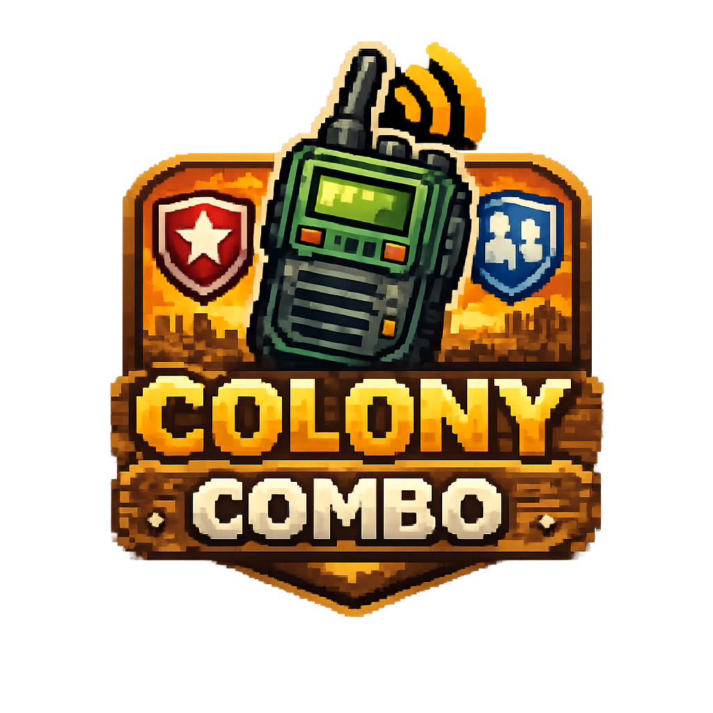

<p align="center">
  
</p>

# Colony Combo

Mobile-first digital board game about building a survivor colony in a hostile world. The project started with mechanical inspiration from Castle Combo, but the goal is to evolve it into its own game identity with a clean, testable architecture.

## Current Status

The project is built with:

- Vite + Vue 3 + TypeScript
- Pinia
- Vue Router
- vue-i18n
- Tailwind CSS
- Vitest
- Vue Testing Library

The architecture is split into clear layers:

- `domain`: pure game rules.
- `application`: use cases and ports.
- `infrastructure`: concrete adapters such as JSON and LocalStorage.
- `presentation`: Vue, routes, stores, and views.
- `lang`: English and Spanish translation files.

## Project Principles

- Domain code must not import Vue, Pinia, Tailwind, LocalStorage, or browser APIs.
- Cards are loaded from JSON.
- Visible UI text must come from i18n translations.
- The UI must be mobile first, vertical, and designed for one-screen gameplay.
- Vue components must not hardcode card abilities.
- Initial persistence uses LocalStorage, but the architecture must allow future migration to Laravel API, Supabase, SQLite, or another backend without changing the domain.
- Code, IDs, and internal naming use English.
- Spanish lives only in translation files.

## Scripts

Install dependencies:

```bash
npm install
```

Start development server:

```bash
npm run dev
```

Run tests:

```bash
npm run test:run
```

Create production build:

```bash
npm run build
```

Preview production build:

```bash
npm run preview
```

## Development Note

This project must be run with Vite during development.

Do not use Go Live or Live Server to open the HTML directly. They do not process Vue Single File Components or TypeScript imports inside `src/`, so the app can appear blank.

## Initial Roadmap

- Build application use cases.
- Connect a Pinia store to those use cases.
- Model placement rules for the 3x3 colony.
- Model players, markets, radio, and turn state.
- Implement card purchase and placement.
- Add face-down cards.
- Add scoring and AI.
- Build the mobile-first game UI.
- Add profile, achievements, statistics, audio, and local saves.
